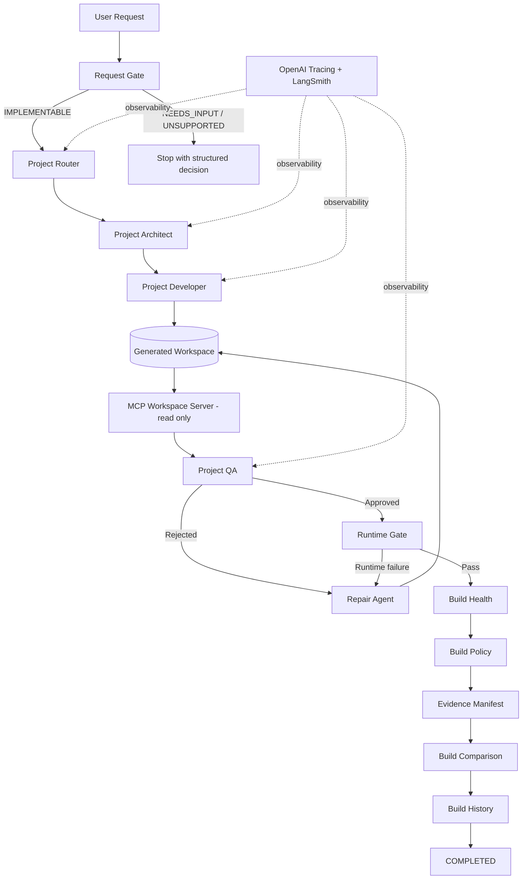
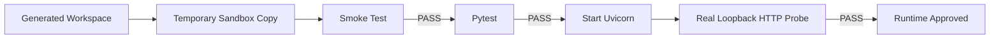

# Project Builder SDK

<p align="center">
  <strong>A governed multi-agent software engineering workflow for turning constrained natural-language requirements into validated FastAPI MVPs.</strong>
</p>

<p align="center">
  
  
  
  
  
</p>

---

## Overview

**Project Builder SDK** is a constrained, observable, multi-agent project-generation system built around the OpenAI Agents SDK.

It does more than ask an LLM to write files. A request moves through a governed workflow with explicit scope validation, architecture planning, requirement preservation, implementation, read-only workspace inspection, QA, bounded repair, sandboxed runtime validation, build health checks, policy evaluation, evidence generation, history, and build-to-build comparison.

V1 is intentionally narrow: it generates small **FastAPI + Pydantic** APIs using in-memory persistence and a fixed seven-file output contract. The scope is constrained on purpose so the workflow can be predictable, inspectable, testable, and governed before broader project types are introduced.

---

## Architecture



### Execution path

```text
Request Gate
    |
    v
Project Router
    |
    v
Project Architect
    |
    v
Project Developer
    |
    v
Workspace
    |
    v
MCP read-only inspection
    |
    v
Project QA
    |
    v
Runtime Gate
    |-- Smoke test
    |-- Pytest
    `-- Real HTTP liveness check
    |
    v
Build Health
    |
    v
Build Policy
    |
    v
Evidence + Comparison + History
    |
    v
COMPLETED
```

When QA or runtime validation fails, the workflow can enter a **bounded repair loop** and return to validation. The default policy allows at most two repair attempts.

---

## Why this project exists

LLM-based code generation is easy to demo and much harder to govern.

Project Builder SDK explores a stricter approach:

- preserve the **original user request** as the highest-authority contract;
- prevent architecture decisions from silently rewriting explicit requirements;
- restrict generated files to a known project shape;
- inspect the generated workspace through a read-only MCP boundary;
- require QA approval before runtime execution;
- run generated code in a controlled temporary workspace;
- require real tests and a real HTTP response;
- bound repair attempts, duration, and token usage;
- generate machine-readable build evidence;
- keep build history and compare quality and performance over time.

The project is primarily an engineering experiment in **agent orchestration, governance, observability, and deterministic guardrails**.

---

## Core capabilities

### 1. Request Gate

The Request Gate decides whether a request fits the current Builder profile before expensive generation begins. It returns `IMPLEMENTABLE`, `NEEDS_INPUT`, or `UNSUPPORTED`, and it is not allowed to make an unsupported request appear valid by silently removing requirements.

### 2. Requirement-contract preservation

The original user request is stored in the workflow context and remains the primary contract.

```text
Original user request
        |
        v
ArchitecturePlan
        |
        v
Implementation
```

Explicit literals, enum values, routes, HTTP codes, transitions, and other user constraints must survive downstream planning.

### 3. Structured multi-agent handoffs

The workflow uses explicit agent responsibilities rather than a single prompt:

- **Request Gate** - scope decision
- **Project Router** - workflow routing
- **Project Architect** - structured architecture plan
- **Project Developer** - implementation
- **Project QA** - contract and code review
- **Repair Agent** - bounded corrective pass

### 4. Fixed workspace contract

V1 generates exactly seven project artifacts:

```text
workspace/
|-- app/
|   |-- __init__.py
|   |-- main.py
|   |-- schemas.py
|   `-- store.py
|-- tests/
|   `-- test_api.py
|-- requirements.txt
`-- README.md
```

The workspace lifecycle removes stale or unexpected artifacts before a fresh build so previous runs cannot contaminate QA or runtime results.

### 5. MCP workspace inspection

The workspace is exposed to the validation layer through a dedicated **read-only MCP server**. Supported operations include workspace snapshot, file listing, file reading, and text search. Absolute paths are rejected and access is constrained to the configured workspace.

### 6. QA gate

QA reviews the actual generated files and compares:

```text
original request <-> ArchitecturePlan <-> implementation
```

The structured QA report includes approval status, score, approved checks, problems found, recommendations, and reviewed files.

### 7. Bounded repair

Rejected builds can enter a repair loop, but repair is intentionally constrained. The default build policy allows:

```text
Maximum repairs: 2
Maximum duration: 120 seconds
Maximum total tokens: 50,000
```

Repair must preserve the original requirement contract.

### 8. SANDBOX_LOCAL runtime

Generated projects are executed from a temporary copy of the workspace. The runtime gate performs:

1. Python/FastAPI smoke test
2. generated-project pytest suite
3. real Uvicorn HTTP liveness check over loopback

The HTTP checker supports applications that expose OpenAPI as well as valid applications that intentionally disable `/openapi.json`.

> **Security note:** `SANDBOX_LOCAL` is a controlled local execution boundary, not kernel, VM, or container isolation. It limits operations, uses temporary copies and timeouts, and cleans registered processes, but it should not be treated as a hardened sandbox for untrusted hostile code.

### 9. Build health and policy

After runtime validation, the Builder evaluates operational quality and policy. Health checks cover workflow completion, QA approval, runtime quality, repair usage, required handoffs, and sandbox cleanup. Policy checks enforce configured budgets and mandatory gates.

### 10. Build evidence

Each completed run can write a structured evidence manifest under:

```text
.project_builder/evidence/
```

Evidence includes build state, QA, runtime, usage, performance, health, policy, and workflow events. The written manifest is accompanied by a SHA-256 digest. Generated state is intentionally excluded from source control.

### 11. Build comparison and history

The orchestration layer records build history and compares the current build with a previous baseline across duration, token usage, requests, QA score, repairs, tests passed, warnings, and policy violations.

### 12. Observability

When LangSmith is configured, the Builder registers the OpenAI Agents tracing integration and emits end-to-end traces.

```text
OpenAI Agents tracing + LangSmith
```

Observability is optional; project generation can run without LangSmith configuration.

---

## Current V1 scope

### Supported

- Python 3.11+
- FastAPI
- Pydantic
- in-memory persistence
- pytest
- httpx
- Uvicorn
- the fixed seven-file output structure

### Not supported in V1

- frontend frameworks or web UIs
- React, Vue, or Angular
- persistent or external databases
- SQLAlchemy or Alembic
- authentication, login, JWT, or OAuth
- Docker generation
- arbitrary additional output files

Unsupported requirements are rejected by the Request Gate rather than silently removed.

---

## Repository structure

```text
project-builder-sdk/
|-- project_builder/
|   |-- agents.py
|   |-- config.py
|   |-- faults.py
|   |-- models.py
|   |-- observability.py
|   |-- request_gate.py
|   |-- runtime.py
|   |-- workflow.py
|   |-- workspace.py
|   |-- mcp/
|   |   |-- runtime.py
|   |   `-- workspace_server.py
|   |-- orchestration/
|   |   |-- comparison.py
|   |   |-- evidence.py
|   |   |-- health.py
|   |   |-- history.py
|   |   |-- hooks.py
|   |   |-- orchestrator.py
|   |   |-- performance.py
|   |   |-- policy.py
|   |   |-- runtime_quality.py
|   |   |-- state.py
|   |   |-- timeline.py
|   |   `-- usage.py
|   `-- sandbox/
|       |-- executor.py
|       `-- policy.py
|-- tests/
|-- .env.example
|-- .gitignore
|-- main.py
|-- pyproject.toml
`-- pytest.ini
```

---

## Installation

```bash
git clone https://github.com/cmosantos/project-builder-sdk.git
cd project-builder-sdk
python -m venv .venv
```

Windows PowerShell:

```powershell
.\.venv\Scripts\Activate.ps1
```

macOS/Linux:

```bash
source .venv/bin/activate
```

Install the project:

```bash
python -m pip install --upgrade pip
python -m pip install -e .
```

---

## Configuration

Create a local `.env` from the example:

```env
OPENAI_API_KEY=
LANGSMITH_API_KEY=
LANGSMITH_TRACING=true
LANGSMITH_PROJECT=project-builder-sdk
```

`OPENAI_API_KEY` is required for agent execution. LangSmith variables are optional and enable tracing when configured. Never commit the real `.env` file.

---

## Running the Builder

```bash
python main.py
```

Or, after installation:

```bash
project-builder
```

The CLI prompts for the project request and executes the governed workflow.

Example request:

```text
Build a FastAPI incident-triage API with in-memory persistence,
Pydantic validation, explicit status transitions, filtering,
automated tests, and no authentication, frontend, Docker,
or external database.
```

---

## Testing

Run the Builder's own test suite:

```bash
python -m pytest -q
```

### Stable V1 acceptance baseline

The stabilized V1 source used for the first public baseline completed its local core suite with:

```text
110 passed
```

A full end-to-end acceptance build also completed with:

```text
Stage              COMPLETED
QA                 APPROVED - 98/100
Repairs            0
Runtime            Smoke PASS - Pytest PASS - HTTP PASS
Runtime quality    HEALTHY
Build health       6 PASS - 0 WARN - 0 FAIL
Build policy       8 PASS - 0 VIOLATIONS
Build duration     50.49 s
LLM requests       6
Total tokens       22,460
```

These are acceptance-run results, not a hosted CI badge.

---

## Runtime validation model



If OpenAPI is available, the HTTP check can validate `/openapi.json` and report the detected OpenAPI version and route count.

If OpenAPI is intentionally disabled, the runtime falls back to liveness semantics: a real non-5xx HTTP response confirms that Uvicorn and the application are reachable, while functional correctness remains the responsibility of the generated pytest suite.

---

## Generated state and source control

The following are local or generated artifacts and are excluded from Git:

```text
.env
.venv/
workspace/
.sandbox/
.project_builder/
.pytest_cache/
__pycache__/
```

---

## Engineering principles

**Contracts before creativity.** Explicit user requirements have higher authority than generated architecture.

**Gates before execution.** Generated code must pass QA before runtime validation.

**Bounded autonomy.** Repairs, time, and token budgets are finite.

**Evidence over assumption.** Runtime checks, test output, traces, and manifests provide observable evidence.

**Read-only inspection.** MCP workspace access is designed for deterministic inspection rather than unrestricted mutation.

**Small supported surface first.** V1 prioritizes reliability and governance over broad framework support.

---

## Roadmap

Potential next steps after the stable V1 baseline:

- CI validation for the repository itself
- dependency locking and reproducible environments
- pluggable project templates
- additional backend profiles
- stronger isolated execution backends
- configurable policy profiles
- richer artifact export
- additional MCP capabilities with explicit permissions
- expanded evaluation and regression datasets

---

## Project status

**Stable V1 baseline.**

The current codebase has completed the intended V1 stabilization cycle for workspace lifecycle, original-requirement preservation, multi-agent handoffs, MCP inspection, bounded repair, runtime validation, HTTP liveness, build health and policy, evidence/history/comparison, and observability.

Future work should be treated as additive evolution rather than continued V1 stabilization.
